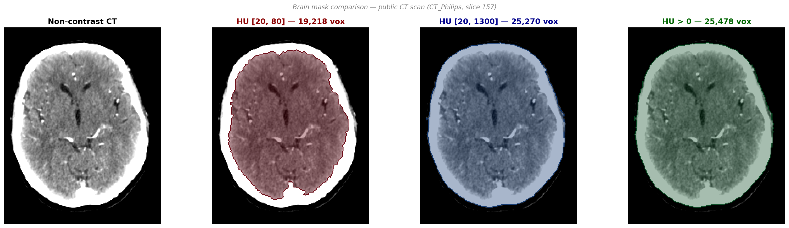
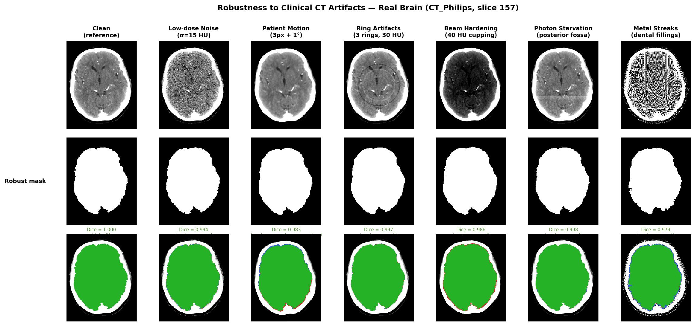
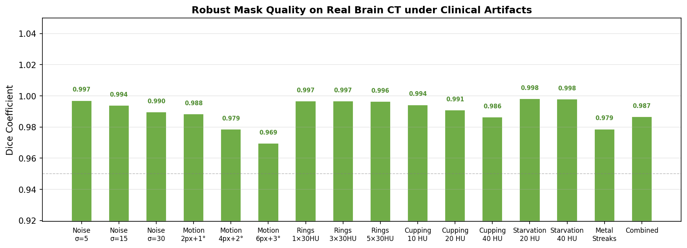

# ct-brain-mask

Simple, robust brain segmentation for non-contrast CT and dynamic CT images using Hounsfield Unit thresholding and morphological operations. No deep learning, no training data — just numpy and scipy.

## Mask Comparison



*Public CT scan from [niivue-images](https://github.com/neurolabusc/niivue-images) (CT_Philips, slice 157).*

| Method | Voxels | Coverage | Skull included? |
|--------|--------|----------|-----------------|
| **HU [20, 80] (ours)** | 19,218 | 44.8% | No |
| HU [20, 1300] | 25,270 | 58.9% | Yes |
| HU > 0 | 25,478 | 59.4% | Yes |

The [20, 80] HU window cleanly isolates brain parenchyma. Broader thresholds include skull and bone, which is problematic for perfusion analysis.

## Algorithm

1. **(Optional) Median filter** — reduces noise and streak artifacts before thresholding (`median_size=3` to `7`)
2. **HU threshold** the CT image at [20, 80] HU
   - Excludes air (< 0 HU), fat/CSF (< 20 HU), bone/skull (> 80 HU)
   - The 80 HU upper bound naturally separates parenchyma from skull — no morphological erosion needed
3. **(Optional) Morphological opening** — removes small fragments from noise or artifacts (`opening=True`)
4. **Binary hole filling** — recaptures ventricles, sulci, and internal CSF spaces
5. **Largest connected component** — removes isolated fragments outside the brain
6. **Final hole fill** — closes any remaining gaps after component selection

Steps 1 and 3 are off by default (`median_size=None`, `opening=False`) to preserve backward compatibility. With default settings, only steps 2/4/5/6 run — identical to the original pipeline.

## Why HU 20–80?

| Tissue | Typical HU |
|--------|------------|
| Air | −1000 |
| Fat | −100 to −50 |
| CSF | 0–15 |
| **White matter** | **20–35** |
| **Gray matter** | **30–45** |
| Blood | 30–45 |
| Soft tissue | 40–80 |
| Bone / skull | 200–3000 |

The [20, 80] window captures all brain parenchyma and blood while naturally excluding skull (typically > 200 HU). CSF-filled spaces (0–15 HU) are excluded by the threshold but recovered by the hole-filling step. This avoids the need for morphological erosion or atlas-based skull stripping.

## Installation

From [PyPI](https://pypi.org/project/ct-brain-mask/) (once published):

```bash
pip install ct-brain-mask
```

From [TestPyPI](https://test.pypi.org/project/ct-brain-mask/) (current):

```bash
pip install --index-url https://test.pypi.org/simple/ --extra-index-url https://pypi.org/simple/ ct-brain-mask
```

From source:

```bash
git clone https://github.com/alhermann/ct-brain-mask.git
cd ct-brain-mask
pip install -e .
```

## Usage

```python
from ct_brain_mask import create_brain_mask

# From a 2D baseline CT image (H, W) in Hounsfield Units
mask = create_brain_mask(ct_baseline_2d)
# Brain mask: 89,527 voxels (34.2% of 512x512) [HU 20-80]

# Custom thresholds
mask = create_brain_mask(ct_baseline_2d, hu_min=10, hu_max=100)

# From a 4D dynamic CT volume (slices, H, W, time)
from ct_brain_mask import create_brain_mask_4d
mask = create_brain_mask_4d(volume_4d, slice_idx=8, n_baseline=3)
```

### Robustness parameters

For noisy or artifact-heavy CT data, optional pre-processing improves mask quality:

```python
# Median filter to reduce noise (kernel size 3 or 5)
mask = create_brain_mask(ct_2d, median_size=3)

# Morphological opening to clean small fragments after thresholding
mask = create_brain_mask(ct_2d, opening=True)          # 1 iteration
mask = create_brain_mask(ct_2d, opening=3)             # 3 iterations

# Combined — best for noisy data with motion artifacts
mask = create_brain_mask(ct_2d, median_size=5, opening=2)
```

Default values (`median_size=None`, `opening=False`) reproduce the original pipeline exactly.

### Robustness results



*Real CT brain (CT_Philips, slice 157) with clinically realistic artifacts. Overlay: green = true positive, red = false positive, blue = false negative. Simulation methods: **sinogram-domain** (metal streaks via Radon transform), **physically accurate image-domain** (noise, cupping, rings), **multi-step approximation** (motion, photon starvation).*



| Condition | Dice | Robust params | Simulation |
|-----------|------|---------------|------------|
| Noise σ=5 | 0.997 | `median_size=3` | Physically accurate |
| Noise σ=15 | 0.994 | `median_size=3` | Physically accurate |
| Noise σ=30 | 0.990 | `median_size=3` | Physically accurate |
| Motion 2px+1° | 0.988 | `median_size=3, opening=True` | Multi-step trajectory |
| Motion 4px+2° | 0.979 | `median_size=3, opening=True` | Multi-step trajectory |
| Motion 6px+3° | 0.969 | `median_size=3, opening=True` | Multi-step trajectory |
| Rings 1×30HU | 0.997 | `median_size=5` | Physically accurate |
| Rings 3×30HU | 0.997 | `median_size=5` | Physically accurate |
| Rings 5×30HU | 0.996 | `median_size=5` | Physically accurate |
| Cupping 10 HU | 0.994 | `median_size=3` | Physically accurate |
| Cupping 20 HU | 0.991 | `median_size=3` | Physically accurate |
| Cupping 40 HU | 0.986 | `median_size=3` | Physically accurate |
| Starvation 20 HU | 0.998 | `median_size=3` | Anatomy-guided |
| Starvation 40 HU | 0.998 | `median_size=3` | Anatomy-guided |
| Metal Streaks | 0.979 | `median_size=7` | Sinogram-domain (Radon) |
| Combined | 0.987 | `median_size=3, opening=2` | Stress test |

All 16 conditions maintain Dice > 0.96 with appropriate robust params. Windmill/helical artifacts are not simulated (require 3D multi-row detector geometry).

### Loading DICOM and NIfTI files

Install IO dependencies with `pip install ct-brain-mask[io]` (requires `pydicom` and `nibabel`):

```python
from ct_brain_mask import load_dicom_file, load_dicom_dir, load_nifti

# Single DICOM file → (H, W) in HU
img = load_dicom_file("path/to/file.dcm")
mask = create_brain_mask(img)

# Directory of DICOMs → (S, H, W) structural or (S, H, W, T) dynamic
volume = load_dicom_dir("path/to/dicom_dir/")

# NIfTI file → numpy array
data = load_nifti("path/to/brain.nii.gz")
```

### API

**`create_brain_mask(ct_baseline_2d, hu_min=20, hu_max=80, median_size=None, opening=False, verbose=True)`**

Create a binary brain mask from a 2D CT image in Hounsfield Units.

| Parameter | Type | Default | Description |
|-----------|------|---------|-------------|
| `ct_baseline_2d` | ndarray (H, W) | required | Baseline CT image in HU |
| `hu_min` | float | 20 | Lower HU threshold |
| `hu_max` | float | 80 | Upper HU threshold |
| `median_size` | int or None | None | Median filter kernel size for noise reduction |
| `opening` | bool or int | False | Morphological opening iterations to clean fragments |
| `verbose` | bool | True | Print mask statistics |

Returns: `ndarray (H, W)`, dtype `bool`

**`create_brain_mask_4d(volume_4d, slice_idx, hu_min=20, hu_max=80, n_baseline=3, median_size=None, opening=False, verbose=True)`**

Convenience wrapper for 4D dynamic CT volumes. Averages the first `n_baseline` frames (pre-contrast) to compute a stable baseline, then calls `create_brain_mask`.

| Parameter | Type | Default | Description |
|-----------|------|---------|-------------|
| `volume_4d` | ndarray (S, H, W, T) | required | 4D dynamic CT volume in HU |
| `slice_idx` | int | required | Slice index to mask |
| `n_baseline` | int | 3 | Pre-contrast frames to average |
| `median_size` | int or None | None | Median filter kernel size |
| `opening` | bool or int | False | Morphological opening iterations |

Returns: `ndarray (H, W)`, dtype `bool`

**`load_dicom_file(filepath)`** — Load a single DICOM file → `(H, W)` in HU.

**`load_dicom_dir(dicom_dir)`** — Load all DICOMs in a directory → `(S, H, W)` or `(S, H, W, T)` in HU.

**`load_nifti(filepath)`** — Load a NIfTI file → numpy array.

## Dependencies

- Python >= 3.8
- numpy
- scipy

Optional: `pip install ct-brain-mask[io]` for DICOM/NIfTI loading (pydicom, nibabel)

## License

MIT
