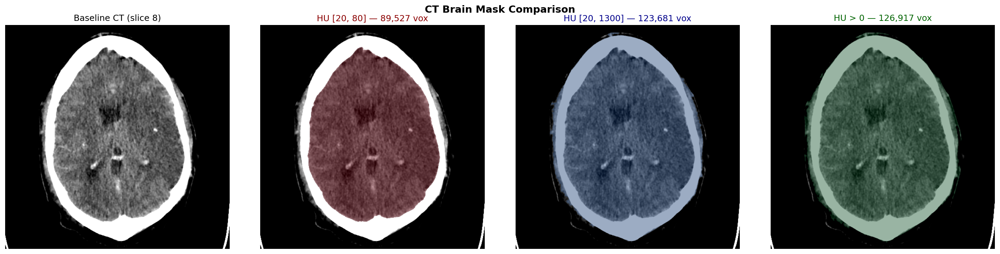

# CT Brain Mask

HU-threshold-based brain segmentation for CT perfusion imaging.

A simple, robust algorithm that segments brain parenchyma from CT images using Hounsfield Unit thresholding and morphological operations. No deep learning required — just numpy and scipy.

## How it works

1. **Threshold** baseline CT at brain parenchyma HU range (default 20–80 HU)
   - Excludes air (< 0 HU), fat/CSF (< 20 HU), bone/skull (> 80 HU)
   - The 80 HU upper bound naturally separates parenchyma from skull without morphological erosion
2. **Fill holes** — captures ventricles, sulci, and internal CSF spaces
3. **Largest connected component** — removes small fragments outside the brain

## Installation

```bash
pip install ct-brain-mask
```

Or from source:

```bash
git clone https://github.com/YOUR_USERNAME/ct-brain-mask.git
cd ct-brain-mask
pip install -e .
```

## Usage

```python
from ct_brain_mask import create_brain_mask

# From a 2D baseline CT image (H, W) in Hounsfield Units
mask = create_brain_mask(ct_baseline_2d)

# From a 4D CT perfusion volume (slices, H, W, time)
from ct_brain_mask import create_brain_mask_4d
mask = create_brain_mask_4d(volume_4d, slice_idx=8)
```

### Parameters

| Parameter | Default | Description |
|-----------|---------|-------------|
| `hu_min` | 20 | Lower HU threshold (excludes CSF/fat) |
| `hu_max` | 80 | Upper HU threshold (excludes skull/bone) |
| `n_baseline` | 3 | Frames to average for baseline (4D only) |
| `verbose` | True | Print mask statistics |

## Why HU 20–80?

| Tissue | HU Range |
|--------|----------|
| Air | -1000 |
| Fat | -100 to -50 |
| CSF | 0–15 |
| **Brain parenchyma** | **20–45** (gray), **20–35** (white) |
| Blood | 30–45 |
| Bone/skull | 200–3000 |

The 20–80 HU window captures all brain parenchyma while naturally excluding skull (no erosion needed) and CSF (which doesn't enhance in perfusion imaging anyway).

## Mask comparison



- **HU [20, 80]** (ours): Clean parenchyma-only mask, no skull contamination
- **HU [20, 1300]**: Includes skull and bone — problematic for perfusion analysis
- **HU > 0**: Includes everything — caused AIF extraction bugs in our pipeline

## Dependencies

- numpy
- scipy

## License

MIT
